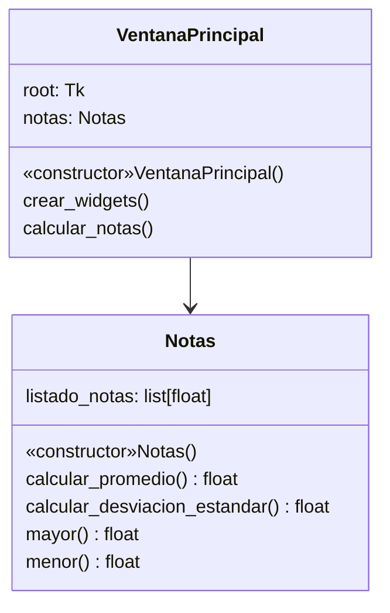
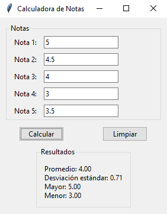
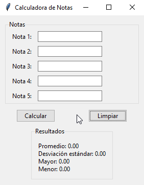
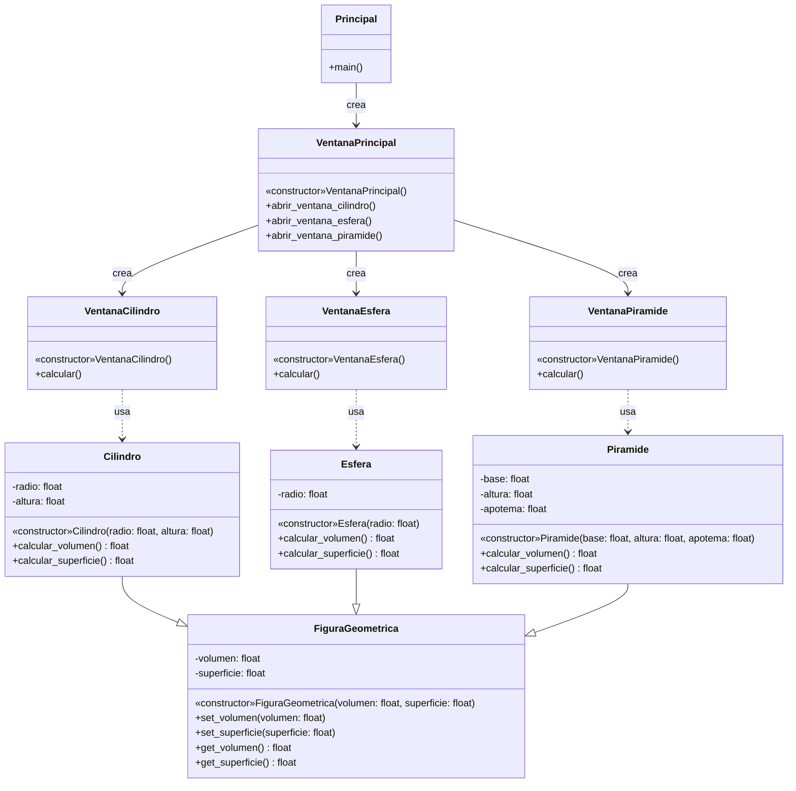
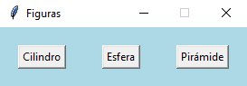
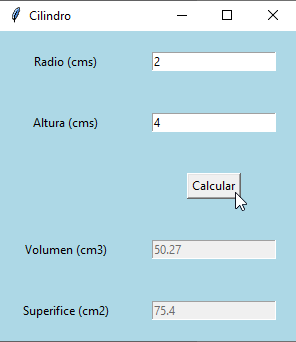
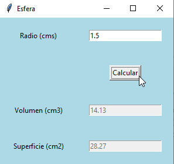
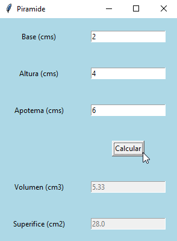

## Ejercicio 8.2 (p.480)

### Enunciado

Se requiere desarrollar un programa con interfaz gráfica de usuario que
genere una ventana donde se solicite el ingreso de cinco notas obtenidas
por un estudiante.
El programa debe calcular y mostrar en la parte inferior de la ventana
los siguientes datos:
- El promedio de notas ingresadas.
- La desviación estándar de las notas ingresadas.
- La mayor nota obtenida.
- La menor nota obtenida.

##### Formula para el calculo de la desviación estándar 

$$ \sigma = \sqrt{\sum(x_i-\mu)^2 \over N} $$

- $\sigma$ = desviación estándar
- $N$ = tamaño de la lista
- $x_i$ = cada valor de la lista
- $\mu$ = media de los valores de la lista

### Diagrama de Casos de uso


### Diagrama de Clases



### Solución

[Click para ver código fuente](https://github.com/Kolozuz/oop_unal_202501_act4/blob/main/Ejercicio1/code.py)

#### Ejecución del programa

```python
# Se crea una instancia de la ventana principal y se inicia el bucle de eventos
my_calculator = VentanaPrincipal()
my_calculator.root.mainloop()
```

**Botón Calcular**



**Botón Limpiar**



## Ejercicio 8.3 (p.494)

### Enunciado

Se requiere desarrollar un programa con interfaz gráfica de usuario que
permita calcular el volumen y superficie de varias figuras geométricas. Las
figuras geométricas son el cilindro, la esfera y la pirámide.
- Para el cilindro se solicitan su radio y altura (en centímetros).
- Para la esfera, su radio (en centímetros).
- Para la pirámide, su base, altura y apotema (en centímetros).

Una vez ingresados estos datos, el programa calcula el volumen y
superficie de cada figura. Para desarrollar el programa se debe crear una
jerarquía de clases para las diferentes figuras geométricas requeridas.

### Diagrama de Casos de uso


### Diagrama de Clases



### Solución

[Click para ver código fuente](https://github.com/Kolozuz/oop_unal_202501_act4/blob/main/Ejercicio2/code.py)

#### Ejecución del programa


```python
figuras_geometricas = Principal()
figuras_geometricas.main()
```

**Ventana principal**



**Cilindro**



**Esfera**



**Pirámide**


