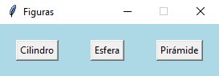
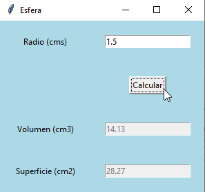

## Ejercicio 8.3 (p.494)

### Enunciado

Se requiere desarrollar un programa con interfaz gráfica de usuario que
permita calcular el volumen y superficie de varias figuras geométricas. Las
figuras geométricas son el cilindro, la esfera y la pirámide.
- Para el cilindro se solicitan su radio y altura (en centímetros).
- Para la esfera, su radio (en centímetros).
- Para la pirámide, su base, altura y apotema (en centímetros).

Una vez ingresados estos datos, el programa calcula el volumen y
superficie de cada figura. Para desarrollar el programa se debe crear una
jerarquía de clases para las diferentes figuras geométricas requeridas.

##### Formulas utilizadas

TODO

### Diagrama de Casos de uso


### Diagrama de Clases


### Solución

#### Definición de clases


```python
from tkinter import *
from tkinter import messagebox
import math

class FiguraGeometrica:
    def __init__(self, volumen, superficie):
        self.__volumen = volumen
        self.__superficie = superficie

    def set_volumen(self, volumen):
        self.__volumen = volumen

    def set_superficie(self, superficie):
        self.__superficie = superficie

    def get_volumen(self):
        return self.__volumen

    def get_superficie(self):
        return self.__superficie

class Cilindro(FiguraGeometrica):
    def __init__(self, radio, altura):
        self.__radio = radio
        self.__altura = altura
        self.set_volumen(self.calcular_volumen())
        self.set_superficie(self.calcular_superficie())

    def calcular_volumen(self):
        volumen = math.pi * self.__altura * math.pow(self.__radio, 2.0)
        return volumen

    def calcular_superficie(self):
        area_lado_a = 2.0 * math.pi * self.__radio * self.__altura
        area_lado_b = 2.0 * math.pi * math.pow(self.__radio, 2.0)
        return area_lado_a + area_lado_b

class Esfera(FiguraGeometrica):
    def __init__(self, radio):
        self.__radio = radio
        self.set_volumen(self.calcular_volumen())
        self.set_superficie(self.calcular_superficie())

    def calcular_volumen(self):
        volumen = 1.333 * math.pi * math.pow(self.__radio, 3.0)
        return volumen

    def calcular_superficie(self):
        superficie = 4.0 * math.pi * math.pow(self.__radio, 2.0)
        return superficie

class Piramide(FiguraGeometrica):
    def __init__(self, base, altura, apotema):
        self.__base = base
        self.__altura = altura
        self.__apotema = apotema
        self.set_volumen(self.calcular_volumen())
        self.set_superficie(self.calcular_superficie())

    def calcular_volumen(self):
        volumen = (math.pow(self.__base, 2.0) * self.__altura) / 3.0
        return volumen

    def calcular_superficie(self):
        area_base = math.pow(self.__base, 2.0)
        area_lado = 2.0 * self.__base * self.__apotema
        return area_base + area_lado

class VentanaCilindro(Toplevel):
    def __init__(self):
        super().__init__()
        self.title("Cilindro")

        self.config(bg = "lightblue")

        self.__volumen_var = StringVar()
        self.__superficie_var = StringVar()

        self.__radio = Label(self, text = "Radio (cms)")
        self.__radio.grid(row = 0, column = 0, padx = 20, pady = 20)
        self.__radio.config(bg = "lightblue")

        self.__altura = Label(self, text = "Altura (cms)")
        self.__altura.grid(row = 1, column = 0, padx = 20, pady = 20)
        self.__altura.config(bg = "lightblue")

        self.__volumen = Label(self, text = "Volumen (cm3)")
        self.__volumen.grid(row = 3, column = 0, padx = 20, pady = 20)
        self.__volumen.config(bg = "lightblue")

        self.__superficie = Label(self, text = "Superifice (cm2)")
        self.__superficie.grid(row = 4, column = 0, padx = 20, pady = 20)
        self.__superficie.config(bg = "lightblue")

        self.__campo_radio = Entry(self)
        self.__campo_radio.grid(row = 0, column = 1, padx = 20, pady = 20)

        self.__campo_altura = Entry(self)
        self.__campo_altura.grid(row = 1, column = 1, padx = 20, pady = 20)

        self.__calcular = Button(self)
        self.__calcular.grid(row = 2, column = 1, padx = 20, pady = 20)
        self.__calcular.config(text = "Calcular", command = self.calcular)

        self.__campo_volumen = Entry(self)
        self.__campo_volumen.grid(row = 3, column = 1, padx = 20, pady = 20)
        self.__campo_volumen.config(state = "disabled")
        self.__campo_volumen.config(textvariable = self.__volumen_var)

        self.__campo_superficie = Entry(self)
        self.__campo_superficie.grid(row = 4, column = 1, padx = 20, pady = 20)
        self.__campo_superficie.config(state = "disabled")
        self.__campo_superficie.config(textvariable = self.__superficie_var)

    def calcular(self):
        error = False
        try:
            radio = float(self.__campo_radio.get())
            altura = float(self.__campo_altura.get())

            cilindro = Cilindro(radio, altura)
            volumen = cilindro.get_volumen()
            superficie = cilindro.get_superficie()

            self.__volumen_var.set(round(volumen, 2))
            self.__superficie_var.set(round(superficie, 2))
        except ValueError:
            error = True
        finally:
            if error:
                messagebox.showerror("Error", "Campo nulo o error en formato de número")

class VentanaEsfera(Toplevel):
    def __init__(self):
        super().__init__()
        self.title("Esfera")
        self.config(bg = "lightblue")

        self.__volumen_var = StringVar()
        self.__superficie_var = StringVar()

        self.__radio = Label(self, text = "Radio (cms)")
        self.__radio.grid(row = 0, column = 0, padx = 20, pady = 20)
        self.__radio.config(bg = "lightblue")

        self.__volumen = Label(self, text = "Volumen (cm3)")
        self.__volumen.grid(row = 2, column = 0, padx = 20, pady = 20)
        self.__volumen.config(bg = "lightblue")

        self.__superficie = Label(self, text = "Superficie (cm2)")
        self.__superficie.grid(row = 3, column = 0, padx = 20, pady = 20)
        self.__superficie.config(bg = "lightblue")

        self.__campo_radio = Entry(self)
        self.__campo_radio.grid(row = 0, column = 1, padx = 20, pady = 20)

        self.__calcular = Button(self)
        self.__calcular.grid(row = 1, column = 1, padx = 20, pady = 20)
        self.__calcular.config(text = "Calcular", command = self.calcular)

        self.__campo_volumen = Entry(self)
        self.__campo_volumen.grid(row = 2, column = 1, padx = 20, pady = 20)
        self.__campo_volumen.config(state = "disabled")
        self.__campo_volumen.config(textvariable = self.__volumen_var)

        self.__campo_superficie = Entry(self)
        self.__campo_superficie.grid(row = 3, column = 1, padx = 20, pady = 20)
        self.__campo_superficie.config(state = "disabled")
        self.__campo_superficie.config(textvariable = self.__superficie_var)

    def calcular(self):
        error = False
        try:
            radio = float(self.__campo_radio.get())
            
            esfera = Esfera(radio)
            volumen = esfera.get_volumen()
            superficie = esfera.get_superficie()

            self.__volumen_var.set(round(volumen, 2))
            self.__superficie_var.set(round(superficie, 2))
        except ValueError:
            error = True
        finally:
            if error:
                messagebox.showerror("Error", "Campo nulo o error en formato de número")

class VentanaPiramide(Toplevel):
    def __init__(self):
        super().__init__()
        self.title("Piramide")
        self.config(bg = "lightblue")

        self.__volumen_var = StringVar()
        self.__superficie_var = StringVar()

        self.__base = Label(self, text = "Base (cms)")
        self.__base.grid(row = 0, column = 0, padx = 20, pady = 20)
        self.__base.config(bg = "lightblue")

        self.__altura = Label(self, text = "Altura (cms)")
        self.__altura.grid(row = 1, column = 0, padx = 20, pady = 20)
        self.__altura.config(bg = "lightblue")

        self.__apotema = Label(self, text = "Apotema (cms)")
        self.__apotema.grid(row = 2, column = 0, padx = 20, pady = 20)
        self.__apotema.config(bg = "lightblue")

        self.__volumen = Label(self, text = "Volumen (cm3)")
        self.__volumen.grid(row = 4, column = 0, padx = 20, pady = 20)
        self.__volumen.config(bg = "lightblue")

        self.__superficie = Label(self, text = "Superifice (cm2)")
        self.__superficie.grid(row = 5, column = 0, padx = 20, pady = 20)
        self.__superficie.config(bg = "lightblue")

        self.__campo_base = Entry(self)
        self.__campo_base.grid(row = 0, column = 1, padx = 20, pady = 20)

        self.__campo_altura = Entry(self)
        self.__campo_altura.grid(row = 1, column = 1, padx = 20, pady = 20)

        self.__campo_apotema = Entry(self)
        self.__campo_apotema.grid(row = 2, column = 1, padx = 20, pady = 20)

        self.__calcular = Button(self)
        self.__calcular.grid(row = 3, column = 1, padx = 20, pady = 20)
        self.__calcular.config(text = "Calcular", command = self.calcular)

        self.__campo_volumen = Entry(self)
        self.__campo_volumen.grid(row = 4, column = 1, padx = 20, pady = 20)
        self.__campo_volumen.config(state = "disabled")
        self.__campo_volumen.config(textvariable = self.__volumen_var)

        self.__campo_superficie = Entry(self)
        self.__campo_superficie.grid(row = 5, column = 1, padx = 20, pady = 20)
        self.__campo_superficie.config(state = "disabled")
        self.__campo_superficie.config(textvariable = self.__superficie_var)

    def calcular(self):
        error = False
        try:
            base = float(self.__campo_base.get())
            altura = float(self.__campo_altura.get())
            apotema = float(self.__campo_apotema.get())

            piramide = Piramide(base, altura, apotema)
            volumen = piramide.get_volumen()
            superficie = piramide.get_superficie()

            self.__volumen_var.set(round(volumen, 2))
            self.__superficie_var.set(round(superficie, 2))
        except ValueError:
            error = True
        finally:
            if error:
                messagebox.showerror("Error", "Campo nulo o error en formato de número")

class VentanaPrincipal(Tk):
    def __init__(self):
        super().__init__()
        self.title("Figuras")
        self.config(bg = "lightblue")

        self.__cilindro = Button()
        self.__cilindro.config(text = "Cilindro", command = self.abrir_ventana_cilindro)
        self.__cilindro.grid(row = 0, column = 0, padx = 20, pady = 20)

        self.__esfera = Button()
        self.__esfera.config(text = "Esfera", command = self.abrir_ventana_esfera)
        self.__esfera.grid(row = 0, column = 1, padx = 20, pady = 20)

        self.__piramide = Button()
        self.__piramide.config(text = "Pirámide", command = self.abrir_ventana_piramide)
        self.__piramide.grid(row = 0, column = 2, padx = 20, pady = 20)

    def abrir_ventana_cilindro(self):
        ventana_cilindro = VentanaCilindro()
        self.wait_window(ventana_cilindro)

    def abrir_ventana_esfera(self):
        ventana_esfera = VentanaEsfera()
        self.wait_window(ventana_esfera)

    def abrir_ventana_piramide(self):
        ventana_piramide = VentanaPiramide()
        self.wait_window(ventana_piramide)

class Principal:
    def main(self):
        mi_ventana_principal = VentanaPrincipal()
        mi_ventana_principal.resizable(False, False)
        mi_ventana_principal.mainloop()
```

#### Ejecución del programa


```python
figuras_geometricas = Principal()
figuras_geometricas.main()
```

**Ventana principal**



**Cilindro**


**Esfera**



**Pirámide**


